# WRL Portal — Architecture Documentation

> **Product:** WRL Portal (WRL Dashboard)  
> **Stack:** Next.js · Supabase (auth/profiles) · Postgres read-model (VPS) · CRM (trhcalls)  
> **Repo:** `fast-close-app`

---

## 0. Start Here

### Run locally

```bash
npm install
npm run dev          # Next.js on localhost:3000
# Optional — point READ_SUMMARY_FROM=postgres in .env.local to query the VPS Postgres instead of CRM
```

For VPS workers (sync + email) see `scripts/vps-hosting/README.md`.

### Reading order for a new developer

| Step | Read | Why |
|---|---|---|
| 1 | **§1 Module Map** | Understand which modules exist and how they connect |
| 2 | **§6 Deployment / Infrastructure** | Know where each piece actually runs |
| 3 | **§7 ETL Data Flow** | Understand CRM → hot table → portal → output |
| 4 | **§8 Background Jobs** | Know what runs on the VPS and when |
| 5 | **§2.1–2.2 Auth + MIS Load** | Two most common user flows |
| 6 | **§2.8–2.12** (cancelled, Athena, digests, subcontractor, attendance) | Newer report + ops flows |
| 7 | **§10 RBAC Flow** | Before touching permissions or API routes |
| 8 | **§11 Failure Paths** | Before touching production |

**Diagram assets:** `docs/diagrams/` — 20 Mermaid sources (`.mmd`) + PNG renders. Regenerate with `node scripts/ops/export-mermaid-diagrams.mjs` after editing diagrams in this file.

---

## 0.1 Known Limitations & Design Decisions

> These are deliberate simplifications or known gaps — not bugs to fix immediately.

| Area | Decision / Limitation | Ceiling / Upgrade path |
|---|---|---|
| **RLS** | Supabase Row-Level Security is not used; access is enforced in application code via RBAC catalog + office-scope filter on every query | Enable RLS policies when multi-tenant isolation becomes a hard requirement |
| **Read-model staleness** | `calls_latest_hot` can lag CRM by up to ~3 min (sync cycle); call detail drawer always hits CRM live | Acceptable for reporting; not suitable for real-time ops |
| **No `.test.tsx` coverage** | UI components have near-zero browser test coverage; server logic has targeted unit tests only (`mail-basis`, `major-repair-alert`) | Add Playwright or Vitest browser tests when UI stabilises |
| **Pagination inconsistency** | Some API routes return all rows (register export), others paginate. No unified cursor scheme | Standardise to cursor-based pagination if row counts grow past ~50k |
| **One-PR-per-slice** | Module boundary discipline is aspirational; some shared logic still lives in root `src/lib` rather than being owned by one module | Enforce via lint rule (`no-cross-module-import`) when team grows |
| **Email transport** | All outbound mail (MIS digest, cancelled digest, major-repair, subcontractor) uses `sendDigestPayload()` / `sendHtmlEmail()` in `mis-email/services/send.ts` — relay on Vercel, direct SMTP on VPS | |
| **Email retry** | Failed digest sends are logged but not retried automatically; next cron poll (15 min) is the retry | Add a send-retry queue if delivery SLA tightens |
| **CRM is MS SQL / read-only** | All CRM writes go through the CRM application, not the portal; portal is strictly a reporting read layer | |
| **VPS Postgres is not HA** | Single-node Postgres on Hostinger VPS; no replica or auto-failover | Migrate to managed Postgres (Supabase, RDS) if uptime SLA requires 99.9%+ |

> **Rule:** Update this document only when the codebase changes (schema migration, new module, new cron job, RBAC change). Do not update speculatively.

---

## 1. System Workflow — Module Map

```mermaid
flowchart TD
    subgraph Browser["Browser (Next.js SSR + Client)"]
        LOGIN["login / forgot-password"]
        REPORT["/report — MIS Reports"]
        ARCP["/report/arcp-claims"]
        DIST["/report/distribution"]
        SERIAL["/report/serial-audit"]
        LOCAUD["/report/location-audit"]
        WARR["/report/warranty-master"]
        CANCEL["/report/cancelled-calls"]
        ATHENA["/report/athena-reconciliation"]
        ADMIN["/admin — Users / Roles / Sync / VPS Cron"]
        ATTEND["/admin/attendance"]
        PROFILE["/profile — Prefs + MIS email"]
        PERF["/admin/performance-insights"]
        MAILSET["/admin/mis-email-settings"]
    end

    subgraph AUTH["auth module"]
        SIGNIN["sign-in"]
        SIGNOUT["sign-out"]
        ME["GET /me"]
        FORGOT["forgot-password"]
        RESET["complete-reset"]
    end

    subgraph MIS["mis module"]
        SUMMARY["Summary Dashboard"]
        REGISTER["Call Register"]
        BDMIS["BD-MIS (Cadbury/Coke merge)"]
        CLIMPORT["Client Import (upload → normalize → batch)"]
    end

    subgraph CALLS["calls module"]
        CALLBYID["call-by-id (CRM full graph)"]
        COMMENTS["comments (Postgres)"]
        FLAGS["flags (portal triage)"]
        OFFICES["offices dimension"]
    end

    subgraph MISMAIL["mis-email module"]
        RUNDIGEST["run-digest (cron + CLI)"]
        COMPOSEDIGEST["compose-digest"]
        MAILBASIS["mail-basis (Cadbury-safe counts)"]
        PREFS["preferences / scheduling"]
        ROUTING["routing-rules (slot dedupe)"]
        SEND["send.ts\nsendDigestPayload · sendHtmlEmail"]
        MAJREP["major-repair-repeat-alert (sync worker)"]
        CANCELDIG["cancelled-call-digest (evening-ops)"]
    end

    subgraph ARCP_MOD["arcp-claims module"]
        ARCPPAGE["ArcpClaimsPageClient"]
        HYBRID["hybrid-load (Postgres ↔ CRM)"]
        ARCPSYNC["sync worker (hot backfill)"]
    end

    subgraph SYNC_MOD["sync module"]
        RMSTATUS["read-model-status API"]
        VPSCRON["vps-cron pause/resume API"]
    end

    subgraph CANCEL_MOD["cancelled-calls module"]
        CANCELREG["Cancelled register (Postgres)"]
        CANCELEX["CSV + digest Excel export"]
    end

    subgraph ATHENA_MOD["athena-reconciliation module"]
        ATHENAPAGE["AthenaReconciliationPageClient"]
        ATHENASYNC["sync + reconcile (read-model)"]
    end

    subgraph ATTEND_MOD["attendance module"]
        ACTIVITY["Service call activity report"]
    end

    subgraph SUBCON_MOD["subcontractor-stock module"]
        SUBCONUI["Mail & Alerts → Subcontractor tab"]
        SUBCONRUN["SAP inbox → reconcile → email (VPS)"]
    end

    subgraph INFRA["Infrastructure / Shared Lib"]
        SUPABASE["Supabase (auth + app_users)"]
        POSTGRES["Postgres VPS (read-model hot tables)"]
        CRM["CRM (trhcalls — source of truth)"]
        SMTP["SMTP / VPS Postfix relay"]
        READMODEL["@/lib/read-model (incremental/nightly sync CLI)"]
        VPSCRONLIB["@/lib/vps-cron (pause catalog)"]
        AUDIT["@/lib/security/audit (logAction)"]
    end

    LOGIN --> AUTH
    REPORT --> MIS
    REPORT --> CALLS
    ARCP --> ARCP_MOD
    DIST --> MIS
    SERIAL --> MIS
    LOCAUD --> MIS
    WARR --> MIS
    CANCEL --> CANCEL_MOD
    ATHENA --> ATHENA_MOD
    ADMIN --> SYNC_MOD
    ATTEND --> ATTEND_MOD
    PROFILE --> MISMAIL
    MAILSET --> MISMAIL
    MAILSET --> SUBCON_MOD

    MIS --> POSTGRES
    MIS --> CRM
    CALLS --> CRM
    CALLS --> POSTGRES

    MISMAIL --> MAILBASIS
    MAILBASIS --> POSTGRES
    MAILBASIS --> MIS
    RUNDIGEST --> COMPOSEDIGEST --> MAILBASIS
    RUNDIGEST --> SEND
    MAJREP --> SEND
    SEND --> SMTP
    RUNDIGEST --> AUDIT
    RUNDIGEST --> ROUTING
    CANCELDIG --> CANCEL_MOD
    CANCELDIG --> SEND

    ARCP_MOD --> POSTGRES
    ARCP_MOD --> CRM

    AUTH --> SUPABASE
    AUTH --> AUDIT

    SYNC_MOD --> VPSCRONLIB
    SYNC_MOD --> POSTGRES

    CANCEL_MOD --> POSTGRES
    ATHENA_MOD --> POSTGRES
    ATHENA_MOD --> CRM
    ATTEND_MOD --> CRM
    SUBCON_MOD --> POSTGRES
    SUBCON_MOD --> CRM
    SUBCON_MOD --> SEND

    READMODEL --> POSTGRES
    READMODEL --> CRM
```

---

## 2. Sequence Diagrams

### 2.1 — User Authentication Flow

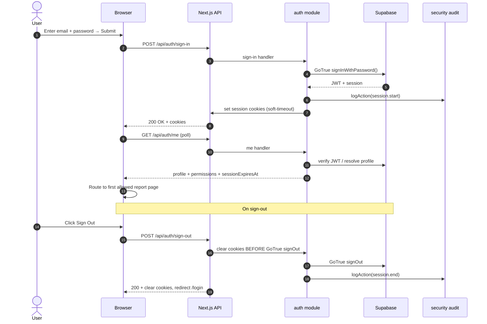

---

### 2.2 — MIS Report Page Load

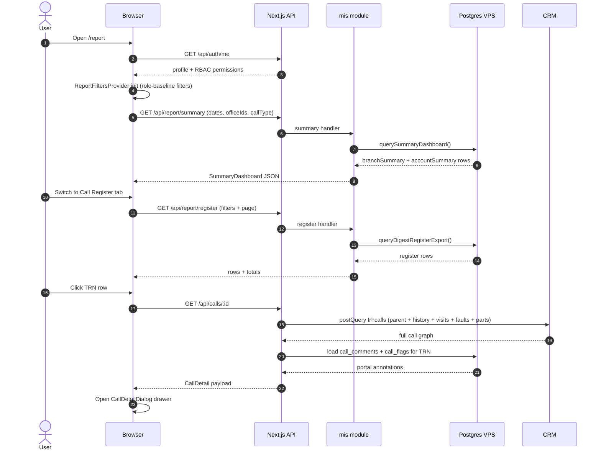

---

### 2.3 — MIS Email Digest (Cron / Automated)

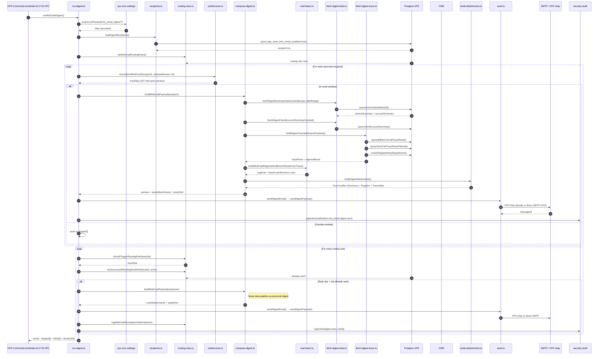

---

### 2.4 — Manual MIS Email Compose & Send (Profile Page)

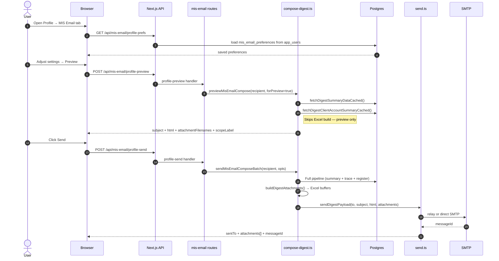

---

### 2.5 — Major Repair Repeat Alert

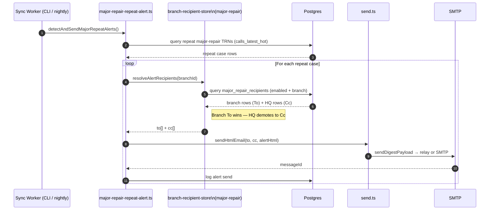

---

### 2.6 — CRM → Postgres Read-Model Sync Pipeline

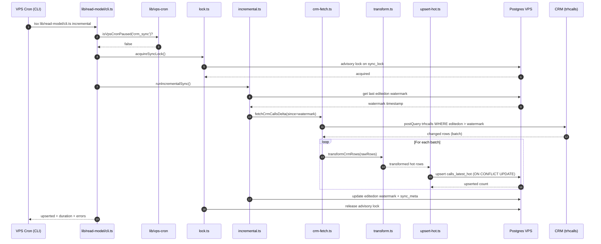

---

### 2.7 — ARCP Claims Load (Hybrid Postgres ↔ CRM)

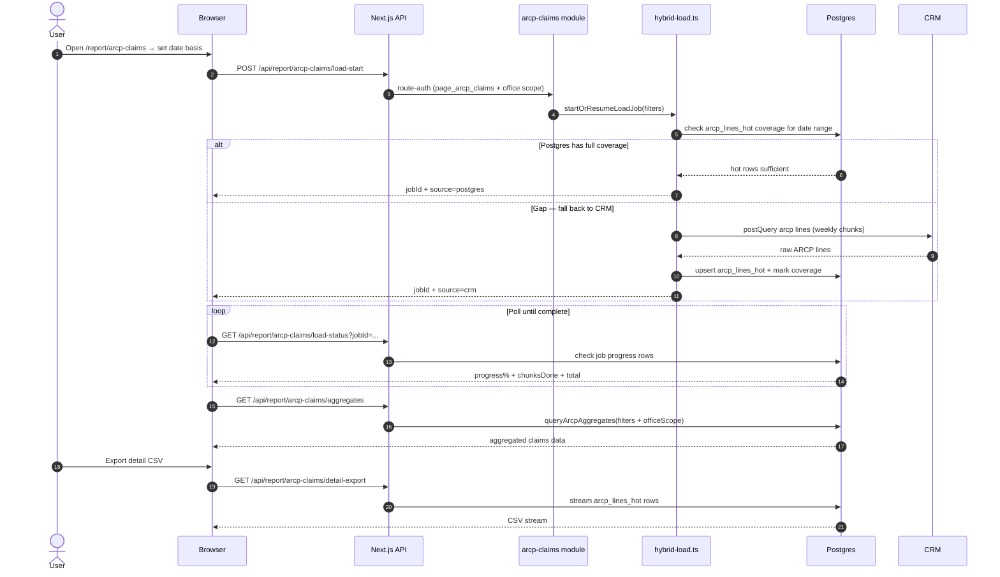

---

### 2.8 — Cancelled Calls Report

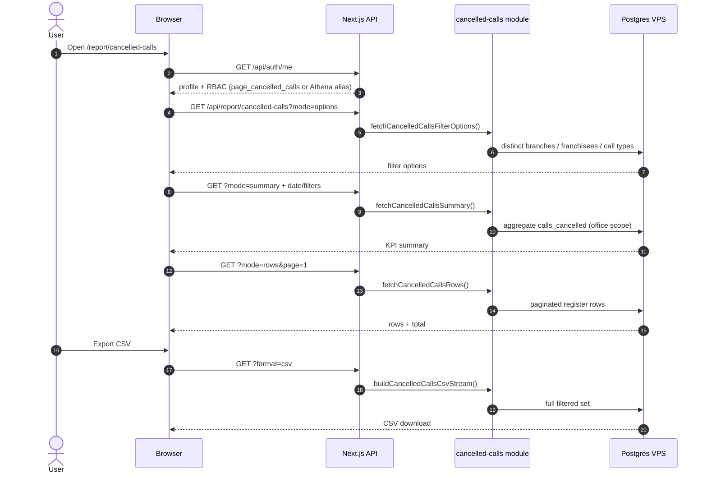

---

### 2.9 — Athena Failed-Calls Reconciliation

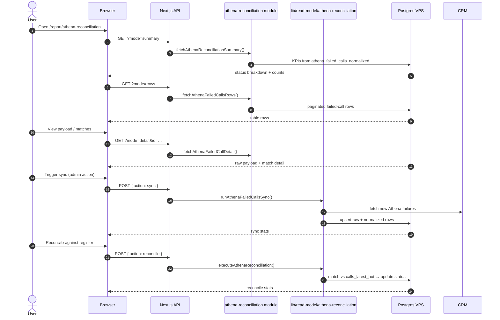

---

### 2.10 — Cancelled Call Digest (Evening Ops)

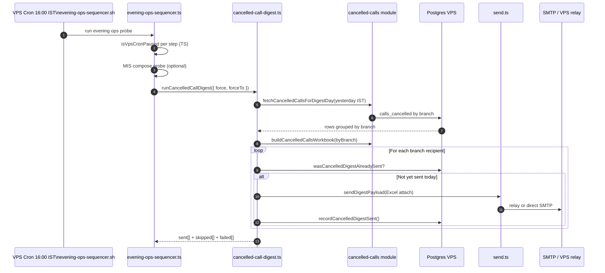

---

### 2.11 — Subcontractor Stock (SAP vs CRM)

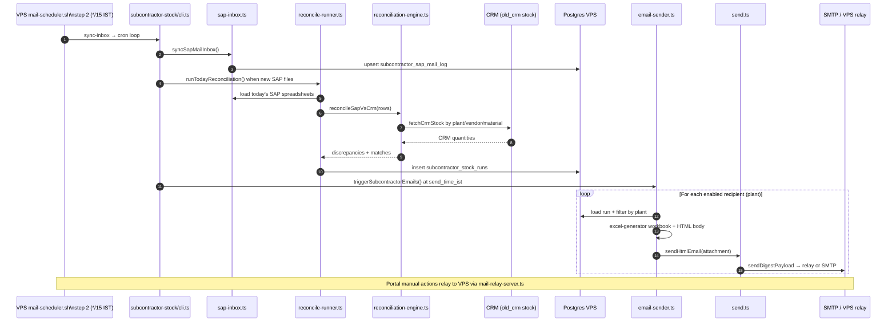

---

### 2.12 — Service Call Activity (Admin)

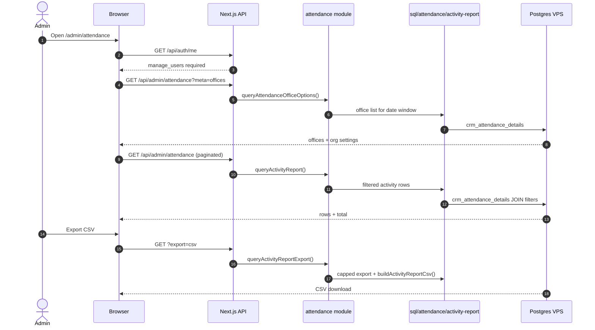

---

## 3. Data Layer Reference

| Table / Source | Owner | Purpose |
|---|---|---|
| `calls_latest_hot` | `@/lib/read-model` | CRM call mirror, incremental sync |
| `calls_cancelled` | `@/lib/read-model/cancelled-call-register` | Cancelled call register (Postgres) |
| `athena_failed_calls_raw` / `_normalized` | `@/lib/read-model/athena-reconciliation` | Athena API failure ingest + match status |
| `crm_attendance_details` | `@/lib/read-model/attendance-details` | Technician activity mirror for admin report |
| `mis_client_import_rows` | `mis` client-import | Uploaded client MIS batches |
| `arcp_lines_hot` | `arcp-claims/sync` | ARCP claim lines hot cache |
| `cancelled_call_digest_recipients` | `mis-email/sync` | Per-branch cancelled digest To list |
| `subcontractor_stock_*` / `subcontractor_sap_mail_log` | `subcontractor-stock` | SAP reconcile config, runs, inbox log |
| `app_users` | Supabase + admin | Portal users, roles, preferences |
| `call_comments` | `calls` module | Portal-only triage notes |
| `call_flags` | `calls` module | Portal triage flags (noted/escalate/query) |
| `mis_email_routing_rules` | `mis-email` | Routing rule schedule + To/Cc |
| `mis_email_routing_send_log` | `mis-email` | Slot dedupe log |
| `major_repair_recipients` | `mis-email/sync` | Alert recipient rows per branch |
| `security_audit_log` | `@/lib/security` | All sensitive actions |
| CRM `trhcalls` | External CRM | Source of truth for all calls |

---

## 4. Permission Gates Summary

| Feature | Required Permission |
|---|---|
| MIS Summary tab | `tab_mis_summary` |
| MIS Register tab | `tab_mis_register` |
| MIS Accounts tab | `tab_mis_accounts` |
| ARCP Claims page | `page_arcp_claims` |
| Distribution page | `page_distribution` |
| Serial Audit | `page_serial_audit` |
| Location Audit | `page_location_audit` |
| Warranty Master | `page_warranty_master` |
| Athena failed-calls | `page_athena_reconciliation` |
| Cancelled Calls | `page_cancelled_calls` (also granted by `page_athena_reconciliation`) |
| MIS Email send | `mis_email_reports` |
| Mail & Alerts (routing, digests, subcontractor) | `page_mis_email_settings` |
| Service call activity | `manage_users` (hard-coded `/admin/attendance`) |
| Admin users | `manage_users` |
| VPS Cron manage | `super_admin` |
| Performance insights | `page_performance_insights` |
| HOD (all offices) | `view_all_offices` |

---

## 5. Module Quick-Reference

Per-module design notes: `src/modules/<name>/README.md`. MIS sub-leaves: `mis/register/`, `mis/client-import/`.

| Module | Path | Key responsibility |
|---|---|---|
| `auth` | `src/modules/auth` | Sign-in/out, /me, password reset |
| `mis` | `src/modules/mis` | Reports: summary, register, BD-MIS, client import |
| `calls` | `src/modules/calls` | Call detail drawer (CRM), comments, flags, offices |
| `mis-email` | `src/modules/mis-email` | Digest scheduler, compose, SMTP send, major-repair + cancelled-call alerts |
| `arcp-claims` | `src/modules/arcp-claims` | ARCP register + hybrid hot/CRM load |
| `sync` | `src/modules/sync` | Read-model status API, VPS cron pause API |
| `performance` | `src/modules/performance` | Web Vitals + server snapshot |
| `distribution` | `src/modules/distribution` | Call distribution + idle assignees |
| `serial-audit` | `src/modules/serial-audit` | Repeat complaint serial history |
| `location-audit` | `src/modules/location-audit` | Tech GPS vs install address |
| `warranty-master` | `src/modules/warranty-master` | Warranty coverage reports |
| `cancelled-calls` | `src/modules/cancelled-calls` | Cancelled register (Postgres), CSV/Excel export, digest data |
| `athena-reconciliation` | `src/modules/athena-reconciliation` | Athena API failure triage + reconcile UI |
| `attendance` | `src/modules/attendance` | Service call activity admin report |
| `subcontractor-stock` | `src/modules/subcontractor-stock` | SAP vs CRM stock reconcile + email (VPS) |
| `roles` | `src/modules/roles` | Role + permission admin UI |
| `users` | `src/modules/users` | User admin UI |
| `security-audit` | `src/modules/security-audit` | Audit log viewer |

---

## 6. Deployment / Infrastructure Diagram

> Where each piece physically runs and how they talk to each other.

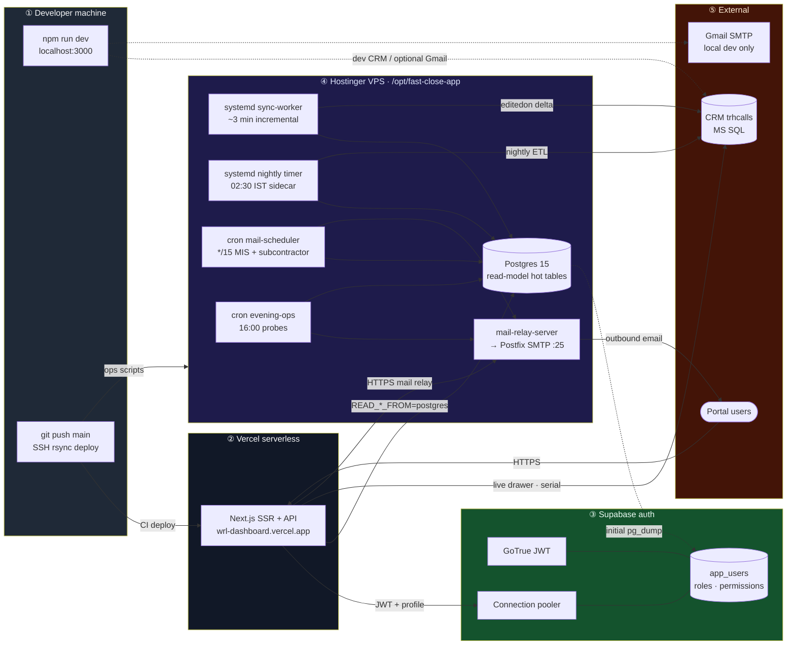

**Key facts:**
- Next.js runs on **Vercel** (serverless); no long-running processes.
- All background workers and crons run on the **Hostinger VPS**.
- Email from Vercel goes over HTTPS to a VPS relay server, which forwards via Postfix (avoids Vercel's SMTP restriction).
- **All outbound mail** (MIS, cancelled digest, major-repair, subcontractor) shares `sendDigestPayload()` / `sendHtmlEmail()` in `mis-email/services/send.ts`.
- Unified `*/15` mail cron: `mail-scheduler.sh` runs MIS digest + subcontractor steps (see [`MAIL_SCHEDULE.md`](MAIL_SCHEDULE.md)).
- Supabase handles **auth only** (GoTrue + app_users); the read-model Postgres is a separate VPS database.

---

## 7. Overall Data Flow / ETL

> Single picture: CRM → Postgres hot tables → Portal queries → Excel / Email output.

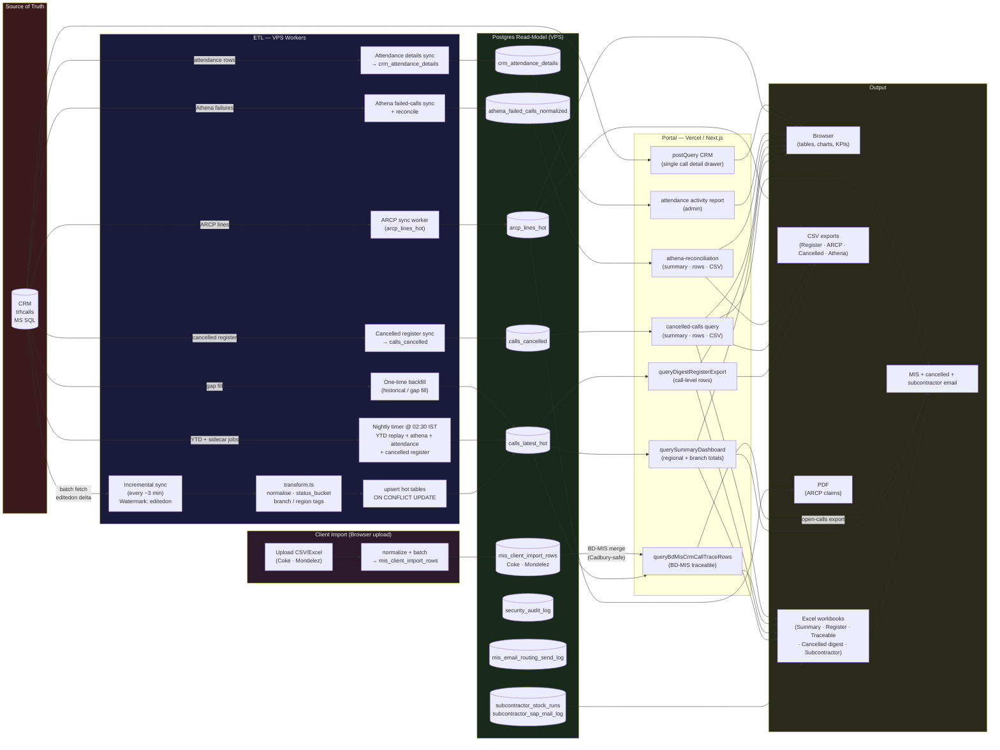

---

## 8. Background Jobs / Cron Map

> Every scheduled or daemon job, its schedule, pause flag, and log location.  
> **Mail-specific schedule:** [`MAIL_SCHEDULE.md`](MAIL_SCHEDULE.md) (canonical cron table).  
> **Sync CLI map:** [`SYNC_ENTRY_POINTS.md`](SYNC_ENTRY_POINTS.md).

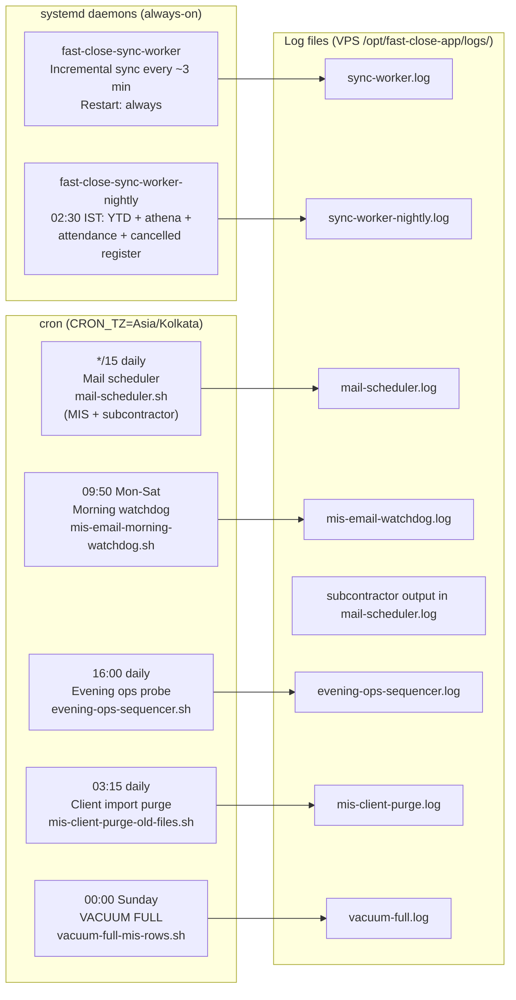

| Job | Schedule (IST) | Days | Pause Flag | Log |
|---|---|---|---|---|
| **CRM incremental sync** | Every ~3 min (systemd daemon) | Mon–Sun | `crm_sync` (portal VPS Cron) | `logs/sync-worker.log` |
| **Nightly sidecar sync** | 02:30 (systemd timer) | Mon–Sun | — | `logs/sync-worker-nightly.log` |
| **Mail scheduler** (`mail-scheduler.sh`) | Every 15 min poll (cron) | Mon–Sun (MIS skips Sunday IST inside script) | `mis_email_digest` + `subcontractor_stock` per step | `logs/mail-scheduler.log` |
| **MIS email test digest** | Ad-hoc cron (optional) | Mon–Sat | `mis_email_test` (portal VPS Cron) | `logs/mis-email-cron.log` |
| **Morning watchdog** | 09:50 | Mon–Sat | — | `logs/mis-email-watchdog.log` |
| **Subcontractor stock** | Via mail-scheduler step 2 | Mon–Sun | `subcontractor_stock` (portal VPS Cron) | `logs/mail-scheduler.log` |
| **Evening ops probe** | 16:00 | Mon–Sun | Per-step in TS (`mis_email_test`, `cancelled_call_digest`, `subcontractor_stock`) | `logs/evening-ops-sequencer.log` |
| **Cancelled-call digest** | Via evening-ops (not standalone */15) | Mon–Sat | `cancelled_call_digest` | `logs/evening-ops-sequencer.log` |
| **Client import file purge** | 03:15 daily | Mon–Sun | — | `logs/mis-client-purge.log` |
| **VACUUM FULL** | 00:00 Sunday | Sun | — | `logs/vacuum-full.log` |
| **ARCP nightly sync** | Via `arcp-nightly.ps1` / CLI | Nightly | — | stdout |

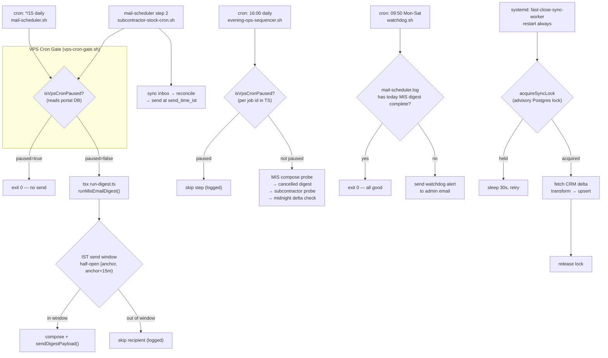

### Portal pause gates (bash vs TypeScript)

| Job / step | Pause ID | Bash gate (`vps-cron-gate.sh`) | TS gate (`isVpsCronPaused`) |
|---|---|---|---|
| MIS digest cron | `mis_email_digest` | Yes — `mis-email-digest.sh` | Inside `runMisEmailDigest` |
| Subcontractor cron | `subcontractor_stock` | Yes — `subcontractor-stock-cron.sh` | Inside subcontractor CLI |
| Mail scheduler | (per step above) | Delegates to child scripts | Delegates to child scripts |
| Evening ops — MIS test | `mis_email_test` | No | Yes — `evening-ops-sequencer.ts` |
| Evening ops — cancelled digest | `cancelled_call_digest` | No | Yes |
| Evening ops — subcontractor | `subcontractor_stock` | No | Yes |
| CRM sync worker | `crm_sync` | No (systemd) | N/A |

---

## 9. Key Tables — Simplified ERD

```mermaid
erDiagram
    app_users {
        uuid id PK
        text email
        text name
        text role
        text[] office_ids
        text[] visible_statuses
        jsonb mis_email_preferences
        boolean mis_email_enabled
        timestamptz created_at
    }

    roles {
        uuid id PK
        text name
        timestamptz created_at
    }

    permissions {
        uuid id PK
        text name
        text description
    }

    role_permissions {
        uuid role_id FK
        uuid permission_id FK
    }

    user_roles {
        uuid user_id FK
        uuid role_id FK
    }

    calls_latest_hot {
        bigint ncode PK
        text trn
        text nofficeid
        text status_bucket
        text client_name
        text region
        text branch
        date complaint_date
        text technician_name
        integer aging_days
        text priority
        timestamptz editedon
        timestamptz synced_at
    }

    arcp_lines_hot {
        bigint id PK
        text trn
        text nofficeid
        date bm_approved_at
        numeric claimed_amount
        numeric bm_approved_amount
        numeric ho_approved_amount
        text status
        timestamptz synced_at
    }

    mis_client_import_rows {
        bigint id PK
        uuid batch_id FK
        text source_code
        text client_name
        text status_bucket
        date complaint_date
        text region
        text branch
        timestamptz created_at
    }

    mis_client_import_batches {
        uuid id PK
        text source_code
        text filename
        integer row_count
        timestamptz uploaded_at
        timestamptz expires_at
    }

    mis_email_routing_rules {
        uuid id PK
        text zone
        text branch
        text client
        text[] to_emails
        text[] cc_emails
        boolean auto_send_enabled
        text schedule_anchor_time_ist
        integer schedule_interval_minutes
        text default_date_range
    }

    mis_email_routing_send_log {
        uuid id PK
        uuid rule_id FK
        text status
        text sent_to
        timestamptz sent_at
    }

    major_repair_recipients {
        uuid id PK
        text branch_id
        text email
        boolean enabled
        boolean is_hq
        timestamptz created_at
    }

    calls_cancelled {
        bigint id PK
        text trn
        text nofficeid
        date cancelled_date_ist
        text branch_name
        text call_type
        text cancel_reason
        timestamptz synced_at
    }

    athena_failed_calls_normalized {
        bigint id PK
        text status
        text failure_reason
        date call_date
        text serial_no
        text outlet_name
        timestamptz reconciled_at
    }

    crm_attendance_details {
        bigint id PK
        integer user_id
        integer office_id
        date activity_date
        text heading
        text unique_call
        timestamptz synced_at
    }

    cancelled_call_digest_recipients {
        uuid id PK
        text branch
        text email
        boolean enabled
    }

    subcontractor_stock_recipients {
        uuid id PK
        text recipient_name
        text email
        text plant_code
        boolean enabled
    }

    security_audit_log {
        uuid id PK
        text action
        text result
        jsonb actor
        jsonb target
        text summary
        jsonb metadata
        timestamptz created_at
    }

    call_flags {
        uuid id PK
        text trn
        text nofficeid
        text flag_type
        text set_by_user_id
        timestamptz created_at
    }

    call_comments {
        uuid id PK
        text trn
        text nofficeid
        text content
        text user_id
        timestamptz created_at
    }

    app_users ||--o{ user_roles : "has"
    roles ||--o{ user_roles : "grants"
    roles ||--o{ role_permissions : "has"
    permissions ||--o{ role_permissions : "in"
    mis_client_import_batches ||--o{ mis_client_import_rows : "contains"
    mis_email_routing_rules ||--o{ mis_email_routing_send_log : "logged by"
    calls_latest_hot ||--o{ call_flags : "flagged by"
    calls_latest_hot ||--o{ call_comments : "annotated by"
    calls_cancelled }o--|| calls_latest_hot : "may reference trn"
    athena_failed_calls_normalized }o--o| calls_latest_hot : "matched against"
```

---

## 10. RBAC Permission Decision Flow

> How every API request resolves access — from cookie to allow/deny.

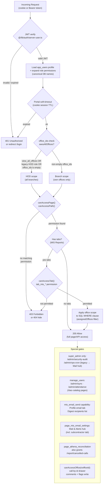

---

## 11. Failure & Degradation Paths

> What actually happens when each external dependency goes wrong.

```mermaid
flowchart TD
    subgraph CRM_FAIL["CRM unavailable / timeout"]
        direction LR
        CRMDOWN["CRM postQuery timeout\nor connection refused"]
        CRMDOWN --> HOTFALLBACK["calls_latest_hot still serves\nSummary + Register (stale)"]
        CRMDOWN --> CALLBYID_FAIL["Call detail drawer → 502/504\n(no hot fallback for full graph)"]
        CRMDOWN --> ARCP_CHUNK["ARCP: split weekly chunks\nretry each window\nnever skip a day"]
        CRMDOWN --> SYNCLOGS["Sync worker logs error\nretries on next 3-min cycle\nno data loss (watermark not advanced)"]
    end

    subgraph SYNC_LOCK["Sync lock held / stuck"]
        direction LR
        LOCKSTUCK["acquireSyncLock() blocked"]
        LOCKSTUCK --> SLEEPRETRY["sleep 30s → retry\nsystemd restarts if crash"]
        LOCKSTUCK --> STALEHOT["calls_latest_hot may drift\n(last sync still served)"]
        LOCKSTUCK --> MANUALFIX["Manual: SELECT pg_cancel_backend()\nor systemctl restart fast-close-sync-worker"]
    end

    subgraph SMTP_FAIL["SMTP / VPS email fails"]
        direction LR
        SMTPFAIL["Postfix / relay error\nor outbound disabled"]
        SMTPFAIL --> DIGESTFAIL["Any sendDigestPayload path\n→ failed[] + audit log"]
        SMTPFAIL --> WATCHDOG2["09:50 watchdog detects no send\n→ alert email to admin\n(via same relay — may also fail)"]
        SMTPFAIL --> NORETRY["No automatic retry of digest\n(next cron poll = next 15 min)"]
        SMTPFAIL --> DRYRUN["MIS_EMAIL_DRY_RUN=true\nlogs payload, skips SMTP"]
    end

    subgraph VPSCRON_PAUSE["VPS Cron paused from portal"]
        direction LR
        PAUSED["isVpsCronPaused() = true\n(portal DB flag)"]
        PAUSED --> SKIPALL["cron shell gate: exit 0\nno digest, no sync trigger"]
        PAUSED --> RESUMEUI["Resume via Mail & Alerts\n→ VPS Cron tab (super_admin)"]
    end

    subgraph POSTGRES_SLOW["Postgres VPS degraded"]
        direction LR
        PGDEG["High seq scan / temp spills\nor connection pool exhaustion"]
        PGDEG --> SLOWQUERIES["Dashboard queries slow\nor timeout (Vercel 10s limit)"]
        PGDEG --> VACUUMFIX["VACUUM ANALYZE\nor VACUUM FULL (Sunday cron)"]
        PGDEG --> INDEXES["Composite indexes:\ncalls_latest_hot (editedon, nofficeid)\nmis_client_import_rows (batch_id, source_code)"]
    end

    subgraph VERCEL_FAIL["Vercel deploy fails / timeout"]
        direction LR
        VFAIL["Build error or\nVPS not reachable"]
        VFAIL --> ROLLBACK["Vercel instant rollback\nto previous deployment"]
        VFAIL --> SKIPBRANCH["Non-main branches skipped\n(ignoreCommand in vercel.json)"]
        VFAIL --> VPSINDEP["VPS workers continue\nindependently of Vercel"]
    end

    subgraph SUPABASE_FAIL["Supabase auth degraded"]
        direction LR
        SFAIL["GoTrue unreachable\nor JWT verify fails"]
        SFAIL --> COOKIEFALLBACK["server-user.ts: cookie-embedded\nuser_id accepted as fallback\n(trusts cookie integrity)"]
        SFAIL --> LOGINBLOCK["sign-in page: returns 503\nno bypass"]
    end

    subgraph SAP_SUBCON_FAIL["SAP inbox / subcontractor stock"]
        direction LR
        SAPMISS["No SAP file for today\nor parse error"]
        SAPMISS --> SUBCONSKIP["cron logs SKIP\nno recipient email sent"]
        SAPMISS --> PORTALRELAY["Portal manual action\nrelays to VPS mail-relay"]
        CRMSTOCK["OLD_CRM_DATABASE_URL unset"]
        CRMSTOCK --> RECONPARTIAL["Reconcile may skip\nCRM stock comparison"]
    end

    subgraph ATHENA_CANCEL_FAIL["Athena / cancelled register stale"]
        direction LR
        SIDECARLAG["Nightly sidecar job failed\n(non-fatal logged)"]
        SIDECARLAG --> STALEATHENA["Athena report shows old failures"]
        SIDECARLAG --> STALECANCEL["Cancelled register lags CRM"]
        SIDECARLAG --> MANUALSYNC["POST reconcile/sync from UI\nor re-run nightly timer"]
    end
```

| Failure | Impact | Recovery |
|---|---|---|
| CRM down | Dashboard serves stale hot data; call drawer fails | Retry next sync cycle; no data loss |
| Sync lock stuck | Hot table drifts until lock released | `systemctl restart fast-close-sync-worker` or cancel Postgres backend |
| SMTP fail | Digest not sent; watchdog fires | Re-run via `npm run mis-email:preview` or next 15-min cron |
| VPS Cron paused | All cron jobs skip silently | Resume via `/admin/vps-cron` (super_admin) |
| Postgres slow | Dashboard timeouts; slow exports | Run VACUUM ANALYZE; check seq scan indexes |
| Vercel deploy fails | UI unreachable | Instant rollback; VPS workers unaffected |
| Supabase auth down | Login blocked; cookie sessions degrade | Cookie fallback for existing sessions |
| SAP file missing | Subcontractor emails skipped for the day | Wait for inbox sync; check `/tmp/extracted_sap` on VPS |
| Athena/cancelled sidecar lag | Reports show stale data | Re-run nightly timer or trigger sync from UI |
