# WRL Portal — Architecture Diagrams

> **Status:** Ready — one diagram per PDF page; wide diagrams use landscape. For full-res labels open `07-Company-Share/Diagrams/*.png`.

Visual reference for stakeholders and IT.

Generated: 2026-09-02

## System workflow overview

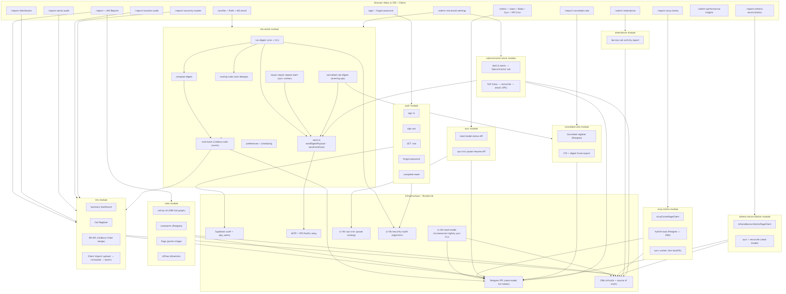

---

## Authentication flow

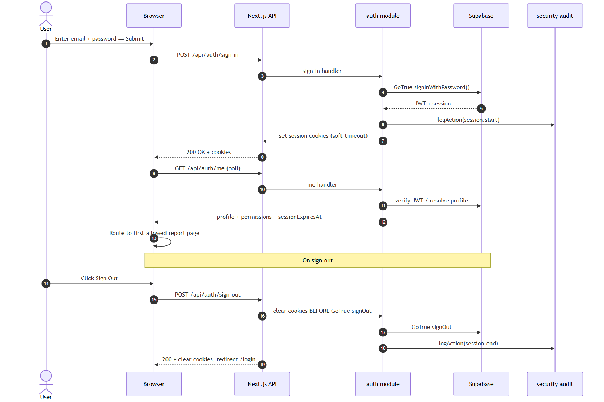

---

## MIS report load

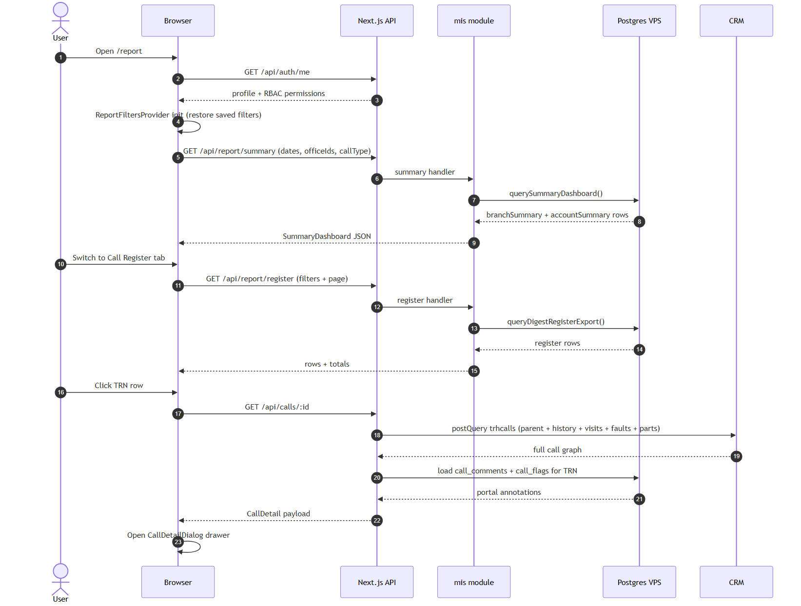

---

## MIS email digest

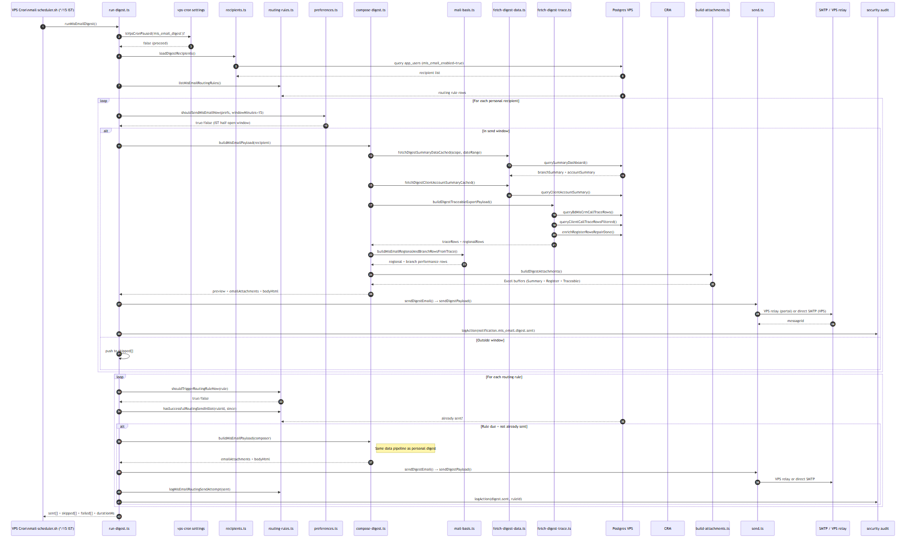

---

## Manual email compose

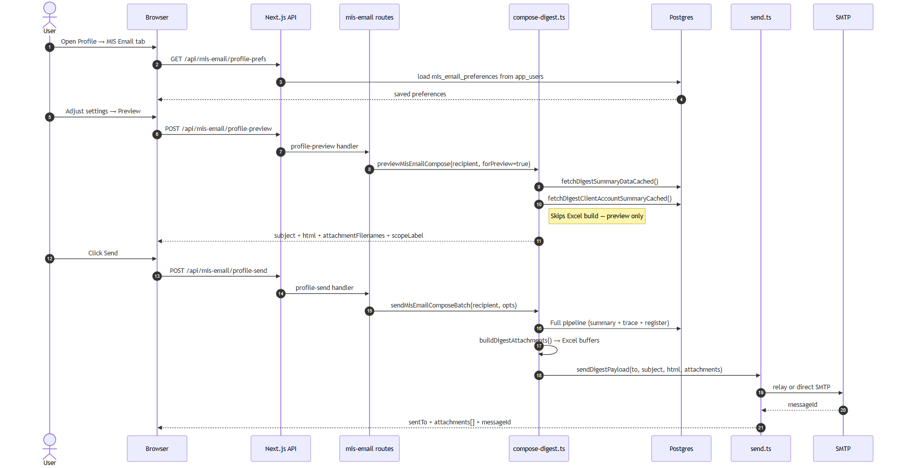

---

## Major repair alert

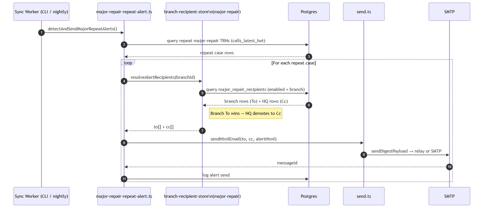

---

## CRM → Postgres sync

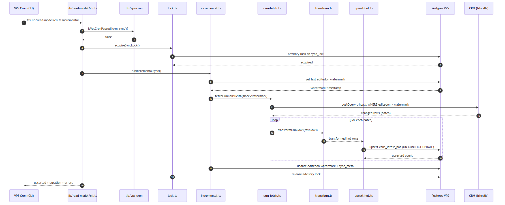

---

## ARCP hybrid load

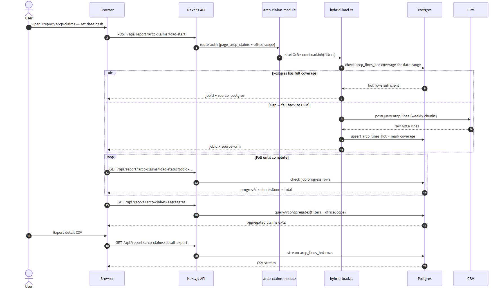

---

## Cancelled calls report

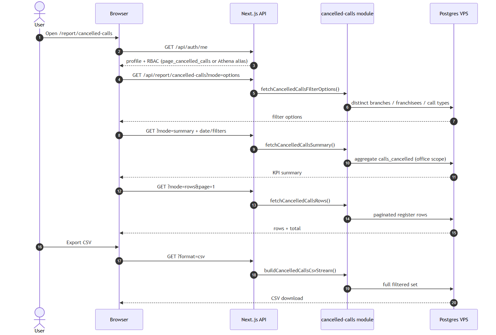

---

## Athena reconciliation

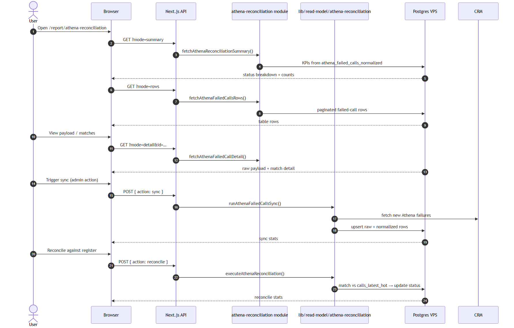

---

## Cancelled call digest

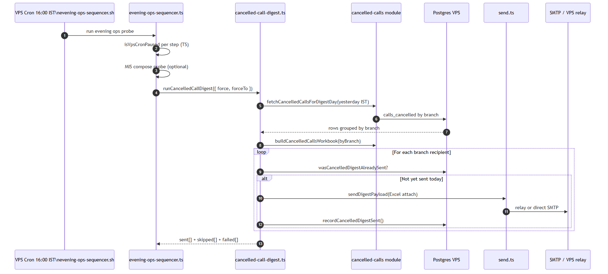

---

## Subcontractor stock

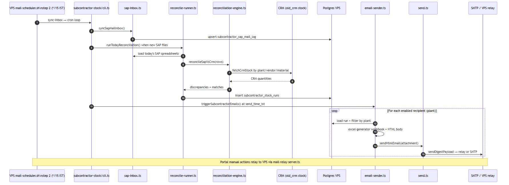

---

## Attendance / service call activity

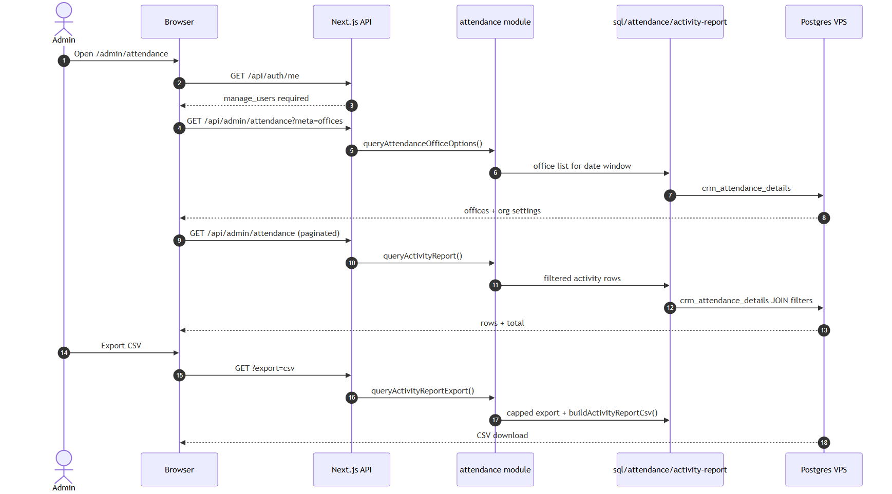

---

## Deployment infrastructure

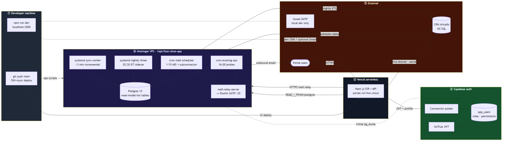

---

## ETL data flow

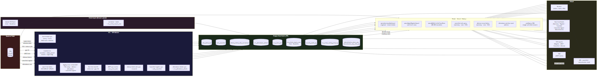

---

## Background jobs overview

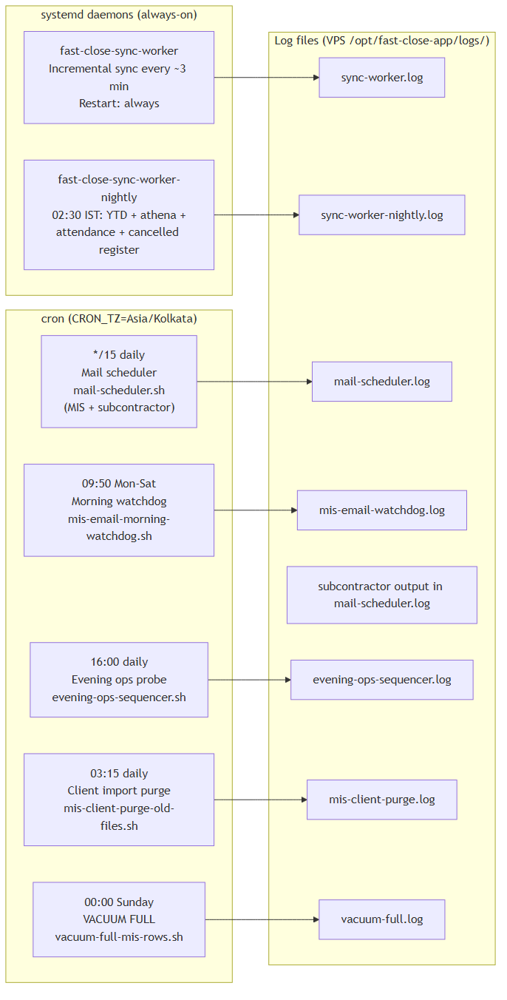

---

## Background jobs cron gate

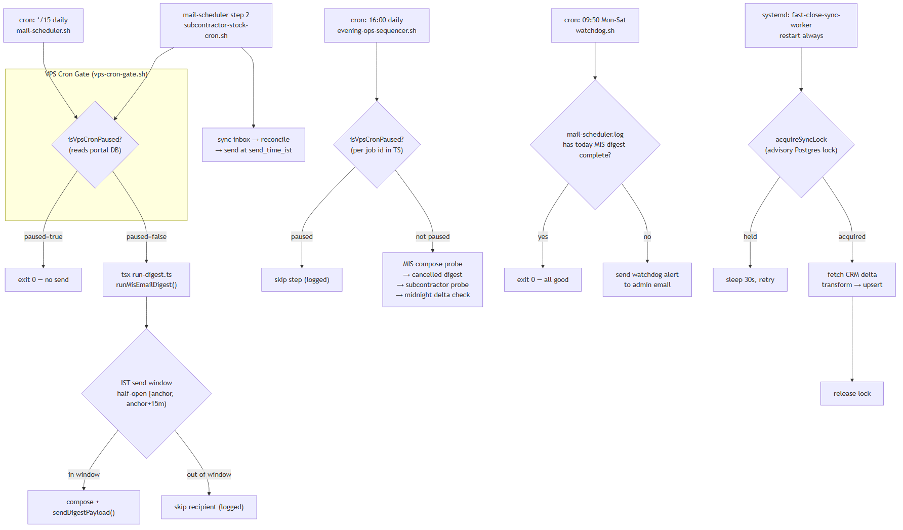

---

## Key tables ERD

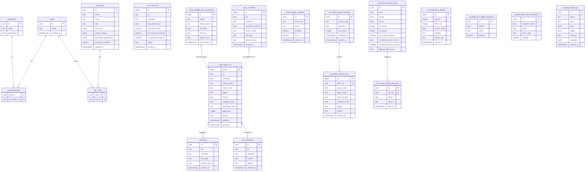

---

## RBAC decision flow

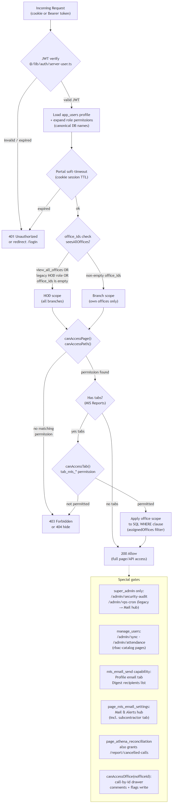

---

## Failure and degradation paths

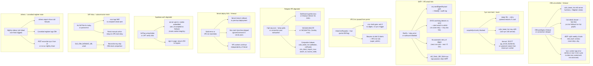

---
