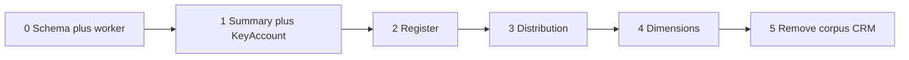

# Phase 1 Cutover Checklist

Companion to [`read-model-phase1-architecture.md`](./read-model-phase1-architecture.md).

**Rule:** When a flow is verified on Postgres, **delete** its CRM and corpus code in the **same PR**. No long-lived dual paths.

---

## Environment flag

```bash
# Global default during migration (per-flow overrides allowed)
READ_CALLS_FROM=crm          # initial
READ_CALLS_FROM=postgres     # after cutover

# Optional per-flow overrides (recommended during staged rollout)
READ_REGISTER_FROM=postgres
READ_SUMMARY_FROM=postgres
READ_DISTRIBUTION_FROM=postgres
READ_DIMS_FROM=postgres
READ_ARCP_FROM=postgres
SYNC_ARCP_ENABLED=true
```

API routes check flag at top; if `postgres`, never call `postQuery()` for that flow.

---

## Pre-cutover gates

- [ ] Schema applied from [`read-model-phase1-schema.sql`](./read-model-phase1-schema.sql)
- [ ] Initial backfill complete (~139,509 hot rows)
- [ ] YTD `call_metrics_daily` populated
- [ ] Incremental sync running; lag < 5 minutes
- [ ] Supabase **Pro** enabled for production (see [infra gate](./read-model-infra-gate.md))
- [x] [`sync-proxy/[table]`](../src/app/api/sync-proxy/[table]/route.ts) — requires `SYNC_PROXY_SECRET` bearer or admin JWT (`manage_users`); set `SYNC_PROXY_CORS_ORIGIN` in prod
- [ ] [`drilldown` customQuery](../src/app/api/report/drilldown/route.ts) removed before prod

---

## Cutover order



---

## Step 0 — Schema + sync worker

**Deliverables:**

- Apply DDL  
- Deploy sync worker (Railway/Fly/Render)  
- Complete initial backfill + verify counts  

**Verify:**

- [ ] `SELECT count(*) FROM calls_latest_hot` ≈ 139,509  
- [ ] `raw_ingest_batches` rows for each backfill chunk  
- [ ] `sync_state.status = 'ok'`  

**Do not change app routes yet.**

---

## Step 1 — Summary + Key Account MIS

**Read from:** `call_metrics_daily` + aging query on `calls_latest_hot` open rows  

**Files to modify:**

| File | Change |
|------|--------|
| [`src/app/api/report/summary/route.ts`](../src/app/api/report/summary/route.ts) | Replace `postQuery` + `deriveSummaryDashboard` with SQL aggregates |
| [`src/app/report/page.tsx`](../src/app/report/page.tsx) | Remove client-side `deriveSummaryDashboard` / corpus path for summary tabs when `READ_SUMMARY_FROM=postgres` |
| [`src/lib/report-summary-derive.ts`](../src/lib/report-summary-derive.ts) | Keep for CRM fallback until deleted; or move aging helpers to shared server module |

**Delete in same PR when verified:**

- [ ] `postQuery` block in `summary/route.ts`  
- [ ] `fetchSummaryFromApi` corpus fallback for summary when on postgres  
- [ ] Client corpus derivation for `activeTab === 'summary' \| 'accounts'`  

**Verify:**

- [ ] Summary tab matches CRM spot-check for current month  
- [ ] Key Account MIS totals match for YTD  
- [ ] Response payload is aggregates only (no raw call arrays)  
- [ ] p95 < 5s  

---

## Step 2 — Register API

**Read from:** `calls_latest_hot` with keyset pagination  

**Files to modify:**

| File | Change |
|------|--------|
| [`src/app/api/report/route.ts`](../src/app/api/report/route.ts) | New thin handler or parallel `register/route.ts`; SQL with keyset |
| [`src/app/report/page.tsx`](../src/app/report/page.tsx) | Stop corpus-first register fetch when `READ_REGISTER_FROM=postgres` |
| [`src/lib/report-search.ts`](../src/lib/report-search.ts) | Server-side search via SQL WHERE (Phase 1: indexed TRN exact match) |

**Delete in same PR when verified:**

- [ ] `LATEST_CALLS_SUBQUERY` / `ROW_NUMBER()` inline SQL in `report/route.ts`  
- [ ] Triple parallel `postQuery` (data + summary + filter options) — summary already on facts  
- [ ] OFFSET pagination  
- [ ] `mergeAuditEnrichment` O(n²) if replaced by Map (keep Supabase flags JOIN)  

**Verify:**

- [ ] Page 1 load: zero `postQuery`  
- [ ] Keyset pagination works (no OFFSET)  
- [ ] Status/office/type filters use indexes  
- [ ] Date range > 90d shows explicit UX message  
- [ ] Export capped at 5,000 rows  
- [ ] p95 < 500ms for 50 rows  

---

## Step 3 — Distribution

**Read from:** `calls_latest_hot` (lat/lng columns)  

**Files to modify:**

| File | Change |
|------|--------|
| ~~`src/app/api/distribution/route.ts`~~ | **Removed** — distribution uses corpus bulk via `ReportFiltersContext` |
| [`src/modules/mis/components/ReportFiltersContext.tsx`](../src/modules/mis/components/ReportFiltersContext.tsx) | Remove distribution hydration from corpus when on postgres |
| [`src/app/report/distribution/page.tsx`](../src/app/report/distribution/page.tsx) | Cap pins at 2,000; show sync timestamp |

**Delete in same PR when verified:**

- [ ] `allCallsCache` Map in distribution route  
- [ ] `getMappedCalls` / `postQuery` in distribution route  
- [ ] `syncDistributionCacheFromCorpus` path  

**Verify:**

- [ ] Map loads without corpus preload  
- [ ] Filter cascade still works  
- [ ] Pin count ≤ 2,000  

---

## Step 4 — Dimension dropdowns

**Read from:** `dim_offices`, `dim_engineers`, `dim_call_types`  

**Files to modify:**

| File | Change |
|------|--------|
| [`src/app/api/offices/route.ts`](../src/app/api/offices/route.ts) | Postgres SELECT |
| [`src/app/api/report/engineers/route.ts`](../src/app/api/report/engineers/route.ts) | Postgres SELECT |
| [`src/app/api/report/call-types/route.ts`](../src/app/api/report/call-types/route.ts) | Postgres SELECT |

**Delete when verified:**

- [ ] CRM `postQuery` in each dim route  
- [ ] In-memory office cache if redundant  

---

## Step 5 — Remove corpus + CRM reporting paths

**Delete (do not feature-flag long-term):**

| Component | Path |
|-----------|------|
| Corpus API (if unused) | [`src/app/api/report/corpus/route.ts`](../src/app/api/report/corpus/route.ts) |
| Corpus client store | [`src/lib/report-corpus.ts`](../src/lib/report-corpus.ts), IndexedDB storage |
| Corpus preload | [`src/modules/mis/components/ReportFiltersContext.tsx`](../src/modules/mis/components/ReportFiltersContext.tsx) — corpus fetch loops |
| Global corpus store | [`src/lib/report-data-store.ts`](../src/lib/report-data-store.ts) — `callCorpusStore` for reporting |
| ~~Legacy cache / sync stubs~~ | **Removed** (`clear-cache`, `/api/sync/*`); `calls_cache` Prisma model dropped |

**Keep (Phase 1 exceptions):**

| Component | Reason |
|-----------|--------|
| [`src/app/api/calls/[id]/route.ts`](../src/app/api/calls/[id]/route.ts) | Call detail — CRM |
| [`src/app/api/report/serial-audit/route.ts`](../src/app/api/report/serial-audit/route.ts) | Serial audit — CRM |
| [`src/lib/db-proxy.ts`](../src/lib/db-proxy.ts) | Sync worker + exceptions only |

**Verify:**

- [ ] Grep `postQuery` — only sync worker, call detail, serial audit, sync scripts  
- [ ] No `callCorpusStore` usage on report/distribution pages  
- [ ] No client-side `deriveSummaryDashboard` on production paths  

---

## Single-source-per-page enforcement

| Page | Allowed source after Step 5 |
|------|----------------------------|
| Register | Postgres only |
| Summary | Postgres only |
| Key Account MIS | Postgres only |
| Distribution | Postgres only |
| ARCP Claims | Postgres only (after Step 6) |
| Call detail | CRM only |
| Serial audit | CRM only |

Code review checklist:

- [ ] No `if (postgres) ... else postQuery()` left in migrated routes  
- [ ] No corpus fallback hidden behind date range  
- [ ] UI shows `Last synced X min ago` on migrated pages  

---

## Rollback plan

If Postgres read fails in prod:

1. Set `READ_CALLS_FROM=crm` (redeploy app — requires CRM paths still in git)  
2. **Therefore:** keep CRM routes in git until one full week stable on Postgres, tagged release before deletion PR  

Recommended: one release with dual flag, second release deleting CRM code after soak period.

---

## Success sign-off

- [ ] All items in architecture doc §15 success criteria  
- [ ] Spot-check: 10 random TRNs match CRM detail  
- [ ] Branch manager role: office scoping works on Postgres queries  
- [ ] No silent partial data for >90d register range  
