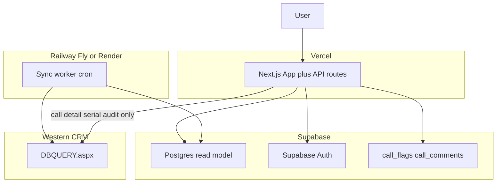

# Infrastructure Gate — Dev vs Production

Companion to [`read-model-phase1-architecture.md`](./read-model-phase1-architecture.md).

---

## Summary

| Environment | Postgres tier | App hosting | Sync worker | CRM access |
|-------------|---------------|---------------|-------------|------------|
| **Local dev** | Supabase Free or local Docker Postgres | `npm run dev` | Run manually / cron locally | `db-proxy` |
| **Staging** | Supabase Pro (recommended) or Free with reduced data | Vercel preview | Railway/Fly staging service | `db-proxy` |
| **Production** | **Supabase Pro (8 GB)** — required before cutover | Vercel | Railway/Fly/Render dedicated | Sync worker + call detail + serial audit only |

**Hard gate:** Do **not** cut over production user traffic to Postgres on Supabase Free.

---

## Supabase Free (dev only)

**Limits relevant to this project:**

- 500 MB database  
- 500 MB RAM shared  
- 5 GB egress/month  

**Fits for dev:**

- ~139k hot rows + YTD facts + indexes ≈ 120–170 MB — tight but workable  
- Single developer incremental sync  

**Does not fit for prod:**

- Index growth, summary expansion, headroom for sync spikes  
- No SLA for reporting workload  
- Shared CPU under concurrent users  

---

## Supabase Pro (production target)

**Before prod cutover:**

- [ ] Upgrade project to Pro (8 GB database)  
- [ ] Confirm `DATABASE_URL` in Vercel prod env  
- [ ] Enable connection pooling (Supabase pooler) for Next.js API if needed  
- [ ] Review RLS: service role for sync worker; API uses server-side connection  

**Estimated Phase 1 usage:** 150–250 MB — comfortable margin on 8 GB.

---

## Component placement



### Vercel (frontend + API)

- Serves Next.js UI and thin read API routes  
- **Must not** run initial backfill or 2–5 min cron sync (timeout limits)  
- Reads Postgres via `DATABASE_URL`  

### Sync worker (NOT Vercel)

- Long-running initial backfill (hours)  
- Incremental sync every 2–5 minutes  
- Nightly reconcile  
- Requires: `DATABASE_URL`, network access to CRM `db-proxy` URL  

**Suggested setup:**

- Railway: Node service + cron trigger, or worker + `node-cron`  
- Fly.io: machine with scheduled jobs  
- Render: background worker  

### CRM HTML proxy

- Phase 1: sync worker uses existing [`src/lib/db-proxy.ts`](../src/lib/db-proxy.ts)  
- User-facing routes stop calling it after cutover (except call detail, serial audit)  

---

## Environment variables

### Next.js app (Vercel)

```bash
DATABASE_URL=postgresql://...          # Supabase pooler or direct
READ_CALLS_FROM=crm|postgres           # migration flag
READ_REGISTER_FROM=...
READ_SUMMARY_FROM=...
READ_DISTRIBUTION_FROM=...
SUPABASE_URL=...
SUPABASE_SERVICE_ROLE_KEY=...          # server only
```

### Sync worker

```bash
DATABASE_URL=postgresql://...          # direct connection preferred for bulk upsert
SYNC_WORKER_ENABLED=true
SYNC_INTERVAL_MINUTES=3
CRM_DBQUERY_URL=...                    # if externalized from db-proxy
```

---

## Data freshness UX copy

Display on migrated pages (header or footer):

**When synced < 5 min ago:**

> Last synced 2 minutes ago

**When synced 5–15 min ago:**

> Last synced 8 minutes ago — data may be slightly behind CRM

**When synced > 15 min ago or worker error:**

> Sync delayed — showing data as of {timestamp}. Call detail opens live CRM record.

**Summary / register footnote:**

> Dashboard counts are eventually consistent within 5 minutes. Open-call aging reflects current open backlog.

**Call detail / serial audit (CRM exception):**

> Live from CRM

---

## Security gates before prod

- [ ] [`sync-proxy/[table]`](../src/app/api/sync-proxy/[table]/route.ts) — require auth or disable public access  
- [ ] Remove `customQuery` from drilldown API  
- [ ] `DATABASE_URL` never exposed to client  
- [ ] Sync worker credentials separate from anon key  

---

## Monitoring (Phase 1 minimum)

| Signal | Source | Alert |
|--------|--------|-------|
| Sync lag | `sync_state.last_run_at` | > 15 min |
| Failed runs | `sync_run_log.status = failed` | 3 consecutive |
| Hot row count | `count(*)` from hot table | > 10% drop day-over-day |
| API latency | Server logs | register p95 > 500ms |
| DB size | Supabase dashboard | > 70% of tier limit |

---

## Go / no-go for production cutover

**Go when all true:**

- [ ] Supabase Pro active  
- [ ] Sync worker deployed and stable 48h in staging  
- [ ] Hot row count within 5% of expected  
- [ ] Summary YTD matches CRM spot-check  
- [ ] Cutover checklist Step 1–4 complete in staging  
- [ ] Rollback tag created with CRM paths intact  

**No-go if:**

- Sync lag routinely > 15 min  
- Free tier still on production project  
- Dual corpus + Postgres paths still active for same page  

---

## Phase 2 infra notes (not built now)

- Expand facts retention → monitor DB size on Pro  
- Serial audit index → may add 50–100 MB  
- Optional read replica only if CRM direct SQL replaces HTML proxy  
- Redis only if summary API p95 exceeds target after indexes  
