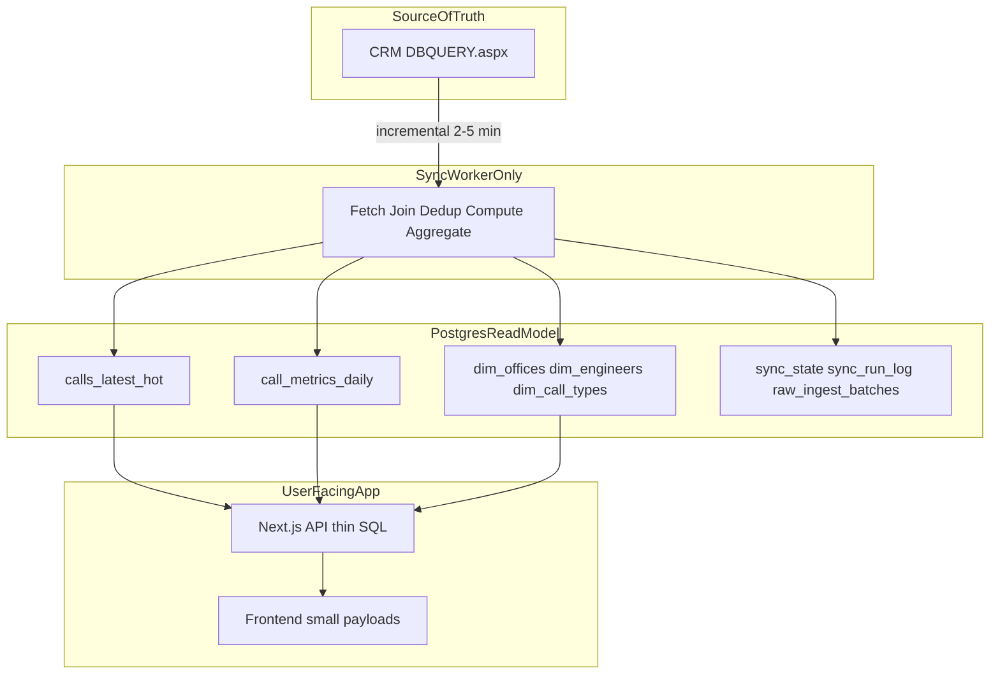

# Read Model — Phase 1 Architecture

**Status:** Pre-implementation specification (approved direction).  
**Gate:** No application cutover until this doc, [schema DDL](./read-model-phase1-schema.sql), [sync worker spec](./read-model-sync-worker-spec.md), [cutover checklist](./read-model-cutover-checklist.md), and [infra gate](./read-model-infra-gate.md) are reviewed.

---

## 1. North star

Remove CRM HTML from the user request path. All normal reporting reads from a processed Postgres read model built by a dedicated sync worker. CRM remains source-of-truth for writes and scoped on-demand exceptions only.



---

## 2. Finalized principles

1. **CRM is source-of-truth only** — no `postQuery()` on user traffic after cutover per flow.
2. **Sync worker is the intelligence layer** — port join/dedup logic from `src/lib/trhcalls-query.ts` and aggregation rules from `src/lib/report-summary-derive.ts`.
3. **Postgres is the read model** — optimized rows, facts, dims only.
4. **Runtime dedup and giant joins die** — no `ROW_NUMBER()` or 10+ join queries in `src/app/api/report/route.ts` after migration.
5. **Counts ≠ rows** — hot detail (90d) vs daily facts (YTD counts) are separate layers.
6. **No half-migration** — delete CRM/corpus paths in the same PR as Postgres cutover per flow.
7. **Rebuildability** — every derived table regeneratable from CRM + sync rules.
8. **Single source per page** — never CRM+Postgres for the same dataset on one screen.
9. **No frontend aggregation at scale** — dashboards read fact tables, not 50k-row corpora.
10. **Strict Postgres typing** — see [§5](#5-strict-typing-rules).

---

## 3. Confirmed scale (CRM measurements)

| Metric | Value |
|--------|-------|
| Raw rows (90d) | 137,724 |
| Unique TRNs (90d) | 137,708 |
| Open calls older than 90d | +1,801 |
| **Total hot TRNs** | **~139,509** |
| Processed row sample (8 joined fields) | ~280 bytes |
| Estimated Phase 1 DB footprint | ~120–170 MB incl. indexes |
| YTD unique calls | 209,985 |
| Watermark columns | `dtrndate`, `editedon`, `addedon` — all `datetime` |

---

## 4. Table catalog

Full DDL: [`read-model-phase1-schema.sql`](./read-model-phase1-schema.sql)

| Table | Purpose | Retention | Grain |
|-------|---------|-----------|-------|
| `calls_latest_hot` | Register, map, drilldown | 90d + open-old | 1 row / `vtrnno` |
| `call_metrics_daily` | Summary, Key Account MIS | Current calendar year | day × office × call_type × account × region |
| `dim_offices` | Office hierarchy labels | Full refresh | 1 row / office |
| `dim_engineers` | Technician dropdown | Full refresh | 1 row / engineer |
| `dim_call_types` | Call type dropdown | Full refresh | 1 row / type |
| `sync_state` | Watermarks | Permanent | 1 row / entity |
| `sync_run_log` | Operational logs | 30-day TTL | 1 row / run |
| `raw_ingest_batches` | Immutable batch audit | 90-day TTL | 1 row / batch |

### 4.1 `calls_latest_hot` — typed columns

| Column | Type | Nullable | Source / notes |
|--------|------|----------|----------------|
| `ncode` | `bigint` | NO | CRM anchor; portal flags JOIN |
| `vtrnno` | `varchar(50)` | NO | PK grain (unique) |
| `vcclid` | `varchar(50)` | YES | Call centre ID |
| `nofficeid` | `bigint` | NO | Office filter / security |
| `nengineer` | `bigint` | YES | `0` = unallocated |
| `office_under` | `bigint` | YES | Parent branch |
| `franchisee_code` | `varchar(50)` | YES | From sync franchisee logic |
| `party_name` | `text` | YES | `mstparty.vname` |
| `branch_name` | `varchar(255)` | YES | Resolved branch display |
| `franchisee_name` | `varchar(255)` | YES | Resolved franchisee |
| `pincode` | `varchar(20)` | YES | |
| `city` | `varchar(255)` | YES | Normalized |
| `state` | `varchar(100)` | YES | Normalized |
| `region` | `varchar(100)` | NO | Default `OTHER` |
| `account` | `varchar(255)` | NO | Default `UNCLASSIFIED` |
| `item_name` | `varchar(255)` | YES | |
| `serial` | `varchar(100)` | YES | |
| `engineer_name` | `varchar(255)` | YES | |
| `call_type` | `varchar(100)` | YES | Display label |
| `complaint` | `text` | YES | |
| `status_label` | `varchar(50)` | YES | UI Status column |
| `status_bucket` | `status_bucket_type` | NO | See [§7](#7-status-bucket-mapping) |
| `solve_remarks` | `text` | YES | |
| `contact_person` | `varchar(255)` | YES | |
| `phone` | `varchar(50)` | YES | |
| `address` | `text` | YES | From `mstparty` (not on `trhcalls`) |
| `has_visit` | `boolean` | NO | Default false |
| `is_major` | `boolean` | NO | Default false |
| `is_part_pending` | `boolean` | NO | Sync-time; see summary derive |
| `branch_headcount` | `integer` | NO | Default 0 |
| `logged_at` | `timestamptz` | NO | `dtrndate` |
| `solved_at` | `timestamptz` | YES | `dsolvedatetime` |
| `edited_at` | `timestamptz` | YES | CRM `editedon` |
| `added_at` | `timestamptz` | YES | CRM `addedon` |
| `source_editedon` | `timestamptz` | YES | Reconciliation watermark per row |
| `bsolved` | `boolean` | YES | Raw flag |
| `bfastclose` | `boolean` | YES | Raw flag |
| `ncancelreason` | `integer` | YES | Raw flag |
| `lat` | `double precision` | YES | Distribution map |
| `lng` | `double precision` | YES | Distribution map |
| `synced_at` | `timestamptz` | NO | Default `now()` |

**Not stored:** 219 CRM columns, revision history, visit/fault/part child rows.  
**Not synced:** `audit_flag` — runtime JOIN to Supabase `call_flags` on `ncode`.

### 4.2 `call_metrics_daily` — typed columns

| Column | Type | Nullable | Notes |
|--------|------|----------|-------|
| `fact_date` | `date` | NO | PK grain — call `logged_at` date |
| `office_id` | `bigint` | NO | PK grain |
| `call_type` | `varchar(100)` | NO | PK grain |
| `account` | `varchar(255)` | NO | PK grain |
| `region` | `varchar(100)` | NO | PK grain |
| `total` | `integer` | NO | |
| `solved` | `integer` | NO | |
| `cancelled` | `integer` | NO | |
| `open_count` | `integer` | NO | |
| `tech_solved` | `integer` | NO | |
| `deployment_total` | `integer` | NO | |
| `deployment_done` | `integer` | NO | |
| `installation_total` | `integer` | NO | |
| `installation_done` | `integer` | NO | |
| `synced_at` | `timestamptz` | NO | |

**Retention:** current calendar year only in Phase 1. Expand in Phase 2.

**Aging buckets (`age_2`, `age_3`, etc.):** computed at API read time from open rows in `calls_latest_hot`, not stored in facts.

### 4.3 Dimension tables

See DDL for `dim_offices`, `dim_engineers`, `dim_call_types`.

### 4.4 Meta tables

See DDL for `sync_state`, `sync_run_log`, `raw_ingest_batches`.

---

## 5. Strict typing rules

| Category | Postgres type |
|----------|---------------|
| CRM numeric IDs | `bigint` |
| TRN / codes | `varchar(50)` |
| Names / labels | `varchar(255)` or `text` |
| Dates | `timestamptz` |
| Booleans | `boolean` |
| Status | `status_bucket_type` enum |
| Fact counts | `integer` |
| Sync status | `sync_batch_status`, `sync_run_status` enums |

**Forbidden:** string dates, CRM `NVARCHAR(MAX)` patterns, unstructured JSON for core fields.

---

## 6. Hot inclusion rule (frozen)

Sync worker includes a row in `calls_latest_hot` when **all** of:

1. `vtrnno` is not null/empty  
2. Transferred calls excluded: `vtransfercallno` empty AND `ncancelreason <> 2` (see `TRHCALLS_EXCLUDE_TRANSFERRED` in `trhcalls-query.ts`)  
3. **Either:**
   - `dtrndate >= now() - interval '90 days'`
   - **OR** open pipeline (see below) AND `dtrndate < now() - interval '90 days'`

**Open pipeline** (for old-open exception, ~1,801 rows):

```sql
ISNULL(bsolved, 0) = 0
AND ISNULL(bfastclose, 0) = 0
AND (ncancelreason IS NULL OR ncancelreason = 0)
```

**Dedup:** one row per `vtrnno`; latest by `editedon DESC NULLS LAST`, then `ncode DESC`.

**Nightly prune:** hard-delete rows that no longer match inclusion (closed + aged out of 90d window).

---

## 7. Status bucket mapping

Port from `classifyRegisterRowStatus` in `src/lib/report-search.ts` at sync time.

| `status_bucket_type` | Register UI label | Condition (simplified) |
|----------------------|-------------------|------------------------|
| `open_unallocated` | Open Unallocated | Open pipeline, engineer null/0 |
| `assigned` | Assigned | Open pipeline, engineer assigned |
| `tech_solved` | Tech. Solve Call | `bfastclose` true, not closed/cancelled |
| `solved` | Closed | `bsolved` or closed status |
| `cancelled` | Cancelled | `ncancelreason` not 0 or 2 |

Transferred calls are **excluded from hot table** at sync (not stored).

Coarse summary bucket (`classifyTrhcallRow` in `trhcalls-query.ts`) maps to facts:

| Fact column | Rule |
|-------------|------|
| `solved` | solved bucket |
| `cancelled` | cancelled bucket |
| `open_count` | open_unallocated + assigned |
| `tech_solved` | tech_solved bucket |

---

## 8. Index strategy

Defined in [`read-model-phase1-schema.sql`](./read-model-phase1-schema.sql).

### `calls_latest_hot`

- UNIQUE `(vtrnno)`
- `(logged_at DESC, ncode DESC)` — keyset pagination
- `(status_bucket, logged_at DESC)`
- `(nofficeid, logged_at DESC)`
- `(call_type, logged_at DESC)`
- `(nengineer, logged_at DESC)` WHERE `nengineer IS NOT NULL`
- `(ncode)`

### `call_metrics_daily`

- PK `(fact_date, office_id, call_type, account, region)`
- `(fact_date)`
- `(office_id, fact_date)`
- `(account, fact_date)`
- `(region, fact_date)`

---

## 9. Page-to-layer mapping

| Page / flow | Read source | Phase 1 range | CRM after cutover |
|-------------|-------------|---------------|-------------------|
| Register | `calls_latest_hot` | 90d + open-old | None |
| Summary Dashboard | `call_metrics_daily` + aging from hot opens | YTD counts | None |
| Key Account MIS | `call_metrics_daily` | YTD | None |
| Distribution map | `calls_latest_hot` | 90d + open-old | None |
| Drilldown | `calls_latest_hot` | Hot window | None |
| Register export | `calls_latest_hot` | Hot window, max 5k | None |
| Serial audit | CRM API | All-time | Stays CRM Phase 1 |
| Call detail | CRM API | Any | Stays CRM Phase 1 |
| Flags / comments | Supabase | JOIN on `ncode` | N/A |
| Offices / engineers / call-types | `dim_*` | All | None |

### Old-data UX

| Request | Response |
|---------|----------|
| Register ≤ 90d | Full detail |
| Register > 90d | Counts from facts if in YTD; explicit message — no silent partial rows |
| Summary / accounts YTD | Full counts from facts |
| Prior years | Phase 2 |
| Old call click | CRM detail panel |

---

## 10. Operational policies

### 10.1 Data freshness

| Layer | Consistency | UI copy |
|-------|-------------|---------|
| Hot rows + facts | Within **5 minutes** of CRM | "Last synced X min ago" |
| Aging buckets | Read-time from hot opens | Same timestamp |
| Call detail / serial audit | Live CRM | Optional "Live from CRM" |

### 10.2 Single source per page

- One primary read source per page/tab (`READ_CALLS_FROM` env per flow).
- No CRM+Postgres mix for same dataset.
- No corpus IndexedDB + Postgres double hydration.

### 10.3 Frontend aggregation forbidden

**MUST NOT:** download 50k corpus, recompute branch/account summary client-side, derive register totals from in-memory caches.

**MAY:** render API aggregates, paginate one API page, JOIN portal flags.

### 10.4 API query contracts

| Endpoint | Max rows | Pagination | Timeout |
|----------|----------|------------|---------|
| Register list | 50/page (max 100) | Keyset `(logged_at, ncode)` | 10s |
| Register export | 5,000 | N/A | 30s |
| Summary / accounts | Aggregates only | N/A | 5s |
| Distribution | 2,000 pins | N/A | 10s |
| Drilldown | 500 | N/A | 10s |
| Dimensions | Small | N/A | 3s |

---

## 11. Source-of-truth, deletion, rebuild

Detailed in [sync worker spec](./read-model-sync-worker-spec.md).

- **CRM wins** on conflict; read model is latest snapshot.
- **Hard delete** on nightly prune when row leaves hot window.
- **Rebuild:** truncate + backfill procedures for hot, facts, dims.
- **raw_ingest_batches:** immutable audit per batch (no payloads).

---

## 12. Cutover

See [cutover checklist](./read-model-cutover-checklist.md).

Order: schema + worker → summary APIs → register → distribution → remove corpus/CRM paths.

---

## 13. Infrastructure

See [infra gate](./read-model-infra-gate.md).

- Dev: Supabase Free  
- Prod: Supabase Pro before cutover  
- Sync worker: Railway/Fly/Render (not Vercel)

---

## 14. Phase boundaries

### Phase 1 (this spec)

- Tables listed in §4  
- Migrate summary, accounts, register, distribution, dims  
- Exceptions: call detail, serial audit → CRM  

### Phase 2

- Expand facts to 1–2 years  
- `open_backlog_snapshot_daily`, `serial_complaint_index`, search index  

### Phase 3

- `calls_archive`, export queue, expanded hot window  

---

## 15. Success criteria

- [ ] Zero `postQuery()` on register, summary, distribution page loads  
- [ ] Register API p95 < 500ms (50 rows)  
- [ ] Sync lag < 5 minutes (UI visible)  
- [ ] No corpus download for migrated flows  
- [ ] No frontend aggregation on migrated flows  
- [ ] Single read source per migrated page  
- [ ] Hot + facts rebuildable via documented procedure  
- [ ] Every sync batch writes `raw_ingest_batches`  

---

## Related documents

| Document | Purpose |
|----------|---------|
| [`read-model-phase1-schema.sql`](./read-model-phase1-schema.sql) | Postgres DDL |
| [`read-model-sync-worker-spec.md`](./read-model-sync-worker-spec.md) | Sync jobs, failure model, rebuild |
| [`read-model-cutover-checklist.md`](./read-model-cutover-checklist.md) | Endpoint migration steps |
| [`read-model-infra-gate.md`](./read-model-infra-gate.md) | Dev/prod hosting rules |
